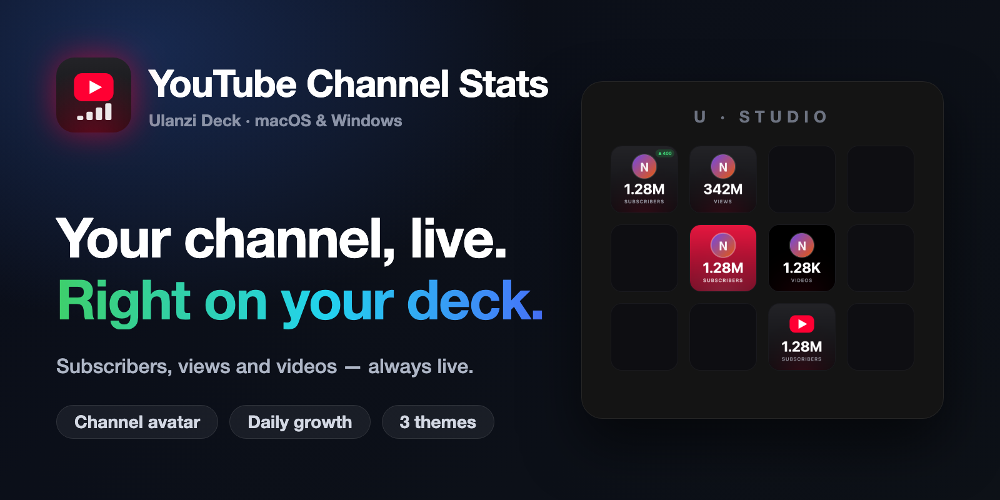
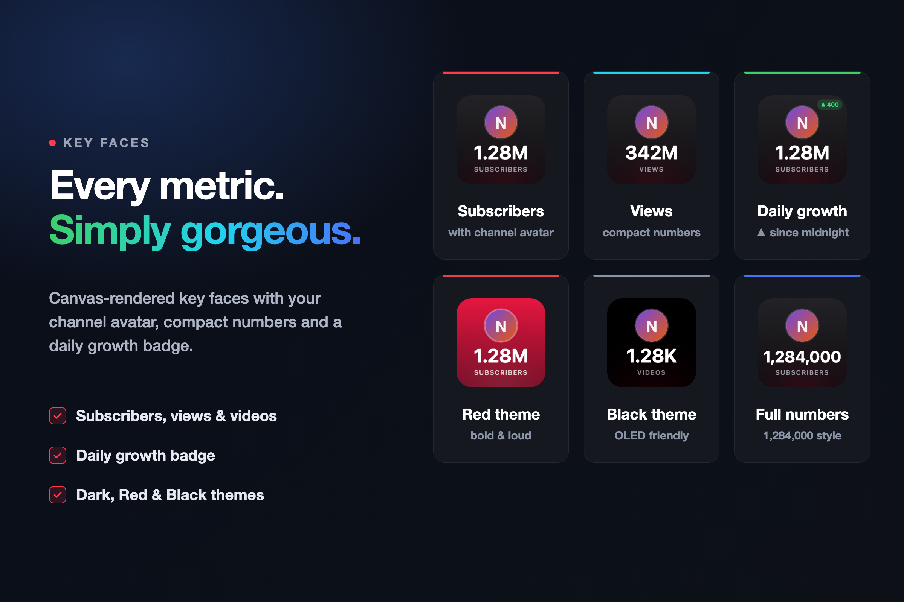
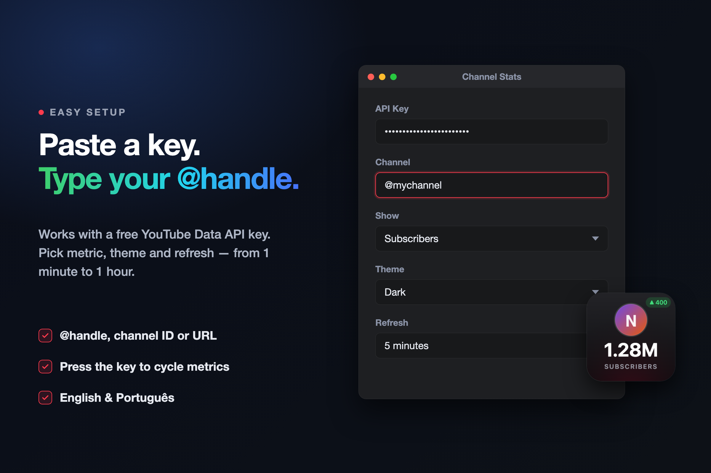

# YouTube Channel Stats — Ulanzi Deck Plugin

Beautiful YouTube channel statistics on your Ulanzi Deck: subscribers, views and video count with the channel avatar, themed key faces and a daily-growth badge.



## Features

- 🎨 **Rich key faces** rendered on canvas: channel avatar, compact numbers (`15.4K`, `2.34M`), clean typography
- 📈 **Daily growth badge** — shows `▲ +N` since the start of the day
- 🖤 **3 themes**: Dark, Red and Black (OLED)
- 🔁 **Press to cycle** between subscribers → views → videos (or press to refresh)
- 🔎 Accepts `@handle`, channel ID (`UC…`) or a full channel URL
- 🌍 Localized (English / Português)

| Key faces | Setup |
|---|---|
|  |  |

## Setup

1. Create an API key for the **YouTube Data API v3** (free): <https://developers.google.com/youtube/v3/getting-started>
2. Drag **Channel Stats** onto a key.
3. Paste the API key, type your channel `@handle` and pick the metric/theme.

The default refresh (5 min) uses ~288 quota units/day — far below the free 10,000/day quota.

## Development

```bash
make install   # symlink the plugin into Ulanzi Deck and restart Ulanzi Studio
make package   # build the distributable zip in dist/
```

`preview-dev.html` renders every key-face state in a browser with fake data — handy for iterating on the design without the deck.

Store art lives in `resources/` and is generated from `tools/*.html` (the key mockups are rendered by the plugin's real renderer). To regenerate:

```bash
CHROME="/Applications/Google Chrome.app/Contents/MacOS/Google Chrome"
"$CHROME" --headless --disable-gpu --hide-scrollbars --force-device-scale-factor=1 --virtual-time-budget=4000 \
  --window-size=1600,800 --screenshot=resources/cover.png "file://$PWD/tools/cover.html"
"$CHROME" --headless --disable-gpu --hide-scrollbars --force-device-scale-factor=1 --virtual-time-budget=4000 \
  --window-size=2400,1600 --screenshot=resources/banner1.png "file://$PWD/tools/banner1.html"
"$CHROME" --headless --disable-gpu --hide-scrollbars --force-device-scale-factor=1 --virtual-time-budget=4000 \
  --window-size=2400,1600 --screenshot=resources/banner2.png "file://$PWD/tools/banner2.html"
```

## Release

Push a `v*` tag — the GitHub Action builds the zip and creates a release.
